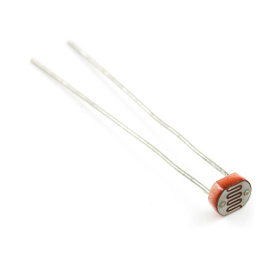
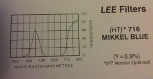
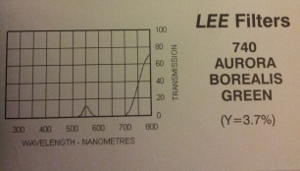
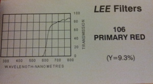
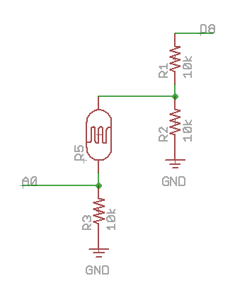

pinoccio-photosynthesis
=======================

ndvi / photosynthesis detector on a pinoccio backpack!

This sensor produces from light reflected from your plants the rate of photosynthesis. the result is the NDVI which is a number based on ratio of red consumed by plants to the near IR range of light scattered.

The scout's rgb led will change colors from cool to hot based on the rate so you can have hours of fun crawling around your yard. Orange = lots of happy plant action . blue or off = no plant action. 

# why

Based off of tech and teaching from http://publiclab.org/wiki/ndvi those folks are awesome. We can determine the overall health of our gardens and build automated farming systems that respond and learn. even call for help.

This approch is a bit different. this would be useless flying on a quadcopter because it collects all of the light as a single pixel if you will. Use this on the ground point it at your garden and collect samples over time! this is why this kind of sensor is so important. You could also do this with a difraction grating and a liner ccd and if you do let me know =) but this is super inexpensive and easy. I got the light filters for free from Sammy's camera. it was a book of samples!

## how?

- i put blue and green filter over the phottocell attached to a1 which combined leave me only near ir 700nm+ , 
- subtract the value from my a1 channel from the value in my red (a0) channel to remove the near IR i left in my red
- generate the ratio and color the led =)
- this near IR approach only works in sunlight. other cominations of light would haved to be compared based on the colors of your indoor lights.

####photo sensors.

the sparkfun photo sensor seems to get more of the near IR range than the one from adafruit. http://dlnmh9ip6v2uc.cloudfront.net/datasheets/Sensors/LightImaging/SEN-09088.pdf
this is important.

####blue filter

this is one of the components of the left "eye" adding this blue removes red but keeps as much of 700+ as possible

####green filter

this is the second filter for the left "eye". this removes most of the leftover blue leaving some slight light blue as noise and leaved me a good chunk of the near infrared. i should be able to find a better match.

####red filter.

this is the only filter on the right "eye". it hass all of the red channel and includes near ir.

## build

- 6 10k resistors
- 2 photocells
- 1 pinoccio protoboard + headers
- light filters for select wavelengths. In a photo store like Sammy's camera they may call them "gels"

1. build 2 of these on the protoboard

send one to a0 and one to a1

2. choose your filters and cut small squares. you can attach them with a little tape on the sides of the filter directly to the photocells or make little goggles so you can slide in and out different filters. If you use tape make sure not to block light going into the photocell. Who knows what spectrum the tape is opaque to. Send the red phototcell to a0 and the blue+green to a1

3. in scout script set pin modes to float `pin.save("a0",0);pin.save("a1",0);`

4. try it out!

